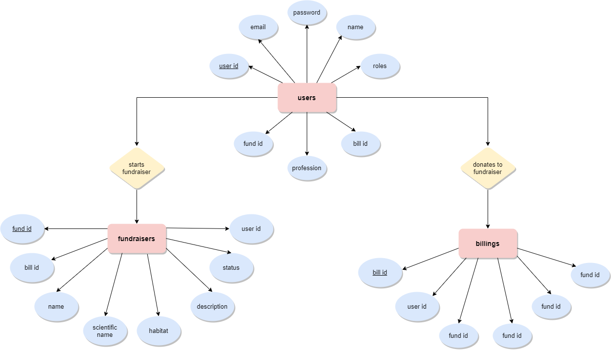

# Crowdfunding Website

Wildlife conservation is of utmost need right now. We find the necessity to be involved in active initiatives, funding and news. A probable path to achieving this could be by creating an online community for the same. A wildlife centric website, with fundraisers, activities, and of course a vivid gallery could establish a connection link between animal lovers, and wildlife conservation workers.

Site Features:
- Login/ Sign-up page with authorization token
- Dashboard to view active fundraising events
- Donate to a conservation project
- Start a fundraiser if you are an organisation
- Gallery of images

## Overview

